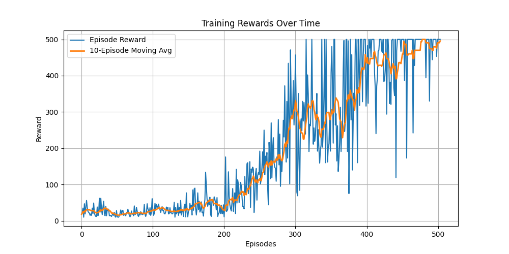

# PPO from Scratch — CartPole

This folder contains a **Proximal Policy Optimization (PPO)** implementation from scratch using PyTorch, applied to the classic `CartPole-v1` environment.

Unlike `ppo_stablebaseline`, this version **does not rely on pre-built libraries** like Stable-Baselines3. It's built from the ground up to understand:

- The PPO clipped objective
- Advantage estimation
- Separate policy and value updates
- Training stability mechanisms

## Core Features

- Pure PyTorch implementation
- Clipped surrogate objective
- Separate actor and critic networks
- Training using mini-batches and epochs
- Rollout buffer with advantage estimation (GAE support optional)

## How to Run

```bash
python train.py
```
Trains a PPO agent from scratch on CartPole and prints reward stats during training.

## Reward Progress

