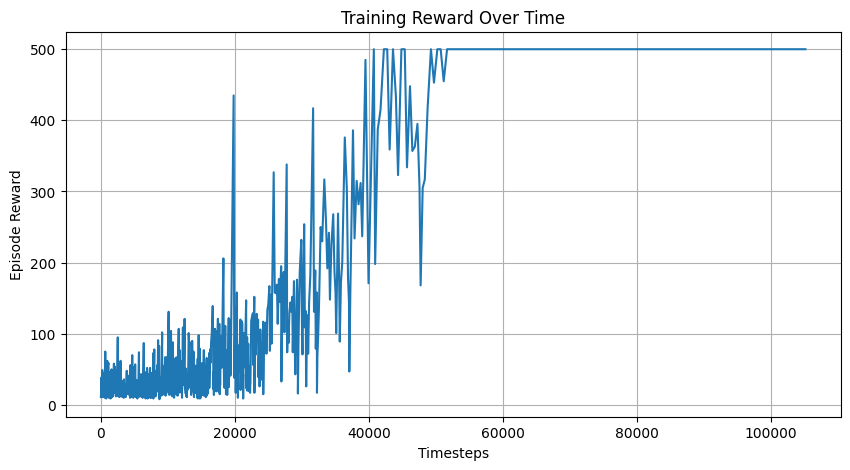

# PPO with Stable-Baselines3 — CartPole

This folder contains a **Proximal Policy Optimization (PPO)** agent built using the `stable-baselines3` library. It's trained on the `CartPole-v1` environment from OpenAI Gym.

This setup is ideal for:
- Fast prototyping
- Getting started with reinforcement learning
- Comparing black-box frameworks with custom implementations

## How to Train

```bash
python main.py
```

This will:
- Create a vectorized environment
- Train the PPO agent for 100,000 timesteps
- Save the model to `models/PPO_CartPole/ppo_cartpole`

## How to Watch the Agent Play
```bash
python evaluate.py
```
Runs the trained agent on CartPole using Gym’s `render_mode="human"`

## How to Record a Video
```bash
python record_video.py
```
Saves an `.mp4` file of the agent playing in the `videos/` folder.

## Training Analysis

Open `analysis.ipynb` to:
- Plot episode rewards over time
- Visualize training progress
- Compare different training runs (if desired)

> Note: reward logging uses `VecMonitor` from `stable-baselines3`.

## Install Dependencies
Install the used libraries using the following command:
```bash
pip install -r requirements.txt

```

## Summary
This folder shows how to quickly build and deploy an RL agent using high-level tools. For a full understanding of PPO internals, see the `ppo_scratch` folder.

## Reward Progress


